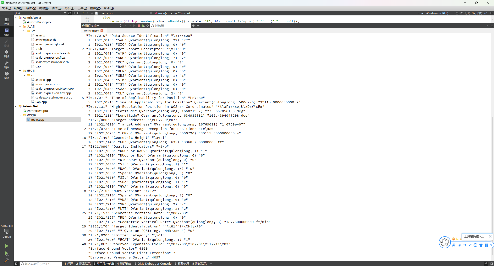
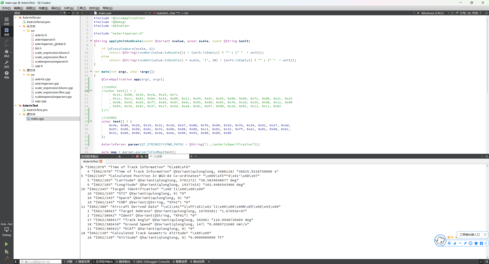

# AsterixParser

  `AsterixParser` 是`Asterix`数据报文解析库。

  关于`Asterix`：<https://www.eurocontrol.int/asterix>

  它简化统一了各个类别的解析工作。

  核心解析部分来自: <https://asterix.sourceforge.net>

  `asterixSpecification` 为规范文件目录`[.XML]`, 生成方式可参考: https://zoranbosnjak.github.io/asterix-specs/index.html

  `Asterix 规范转换器` 可参考: https://github.com/CroatiaControlLtd/asterix/tree/master/asterix-specs-converter

---

### 目前支持的Asterix类别

  - Cat1 (track UAP only)
  - Cat2
  - Cat4
  - Cat7 (downlink UAP only)
  - Cat8
  - Cat10
  - Cat11
  - Cat20
  - Cat21
  - Cat23
  - Cat34
  - Cat48
  - Cat62
  - Cat63
  - Cat64
  - Cat65
  - Cat240
  - Cat247

---

### 如何构建

  构建 `AsterixParser`, 构建文件 `AsterixParser.pro`, 生成目录`/buildlib`。

---

### 如何使用

  使用 `parseToFsnMap()` / `parseToIdMap()` 将报文解析为映射。

  具体可运行示例: `example/example.pro`。

 - Cat021 解析结果示例

  

 - Cat062 解析结果示例

  

---

### 许可证

  使用 `MIT LICENSE`

---

### 开发环境

  Windows 11，Qt 5.15.2
